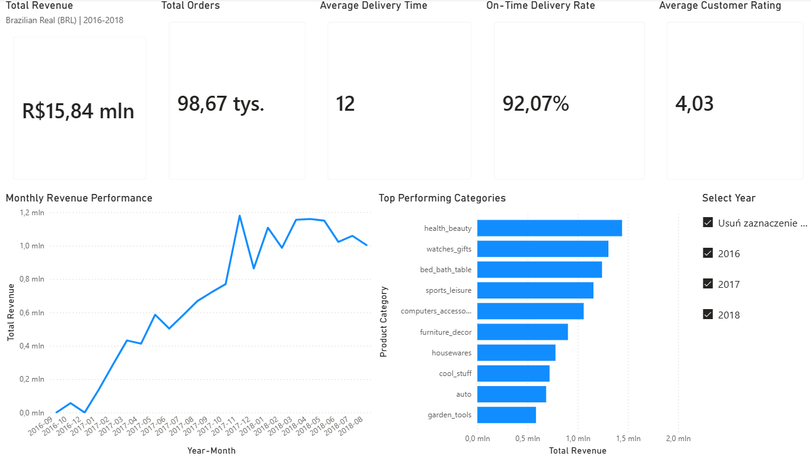
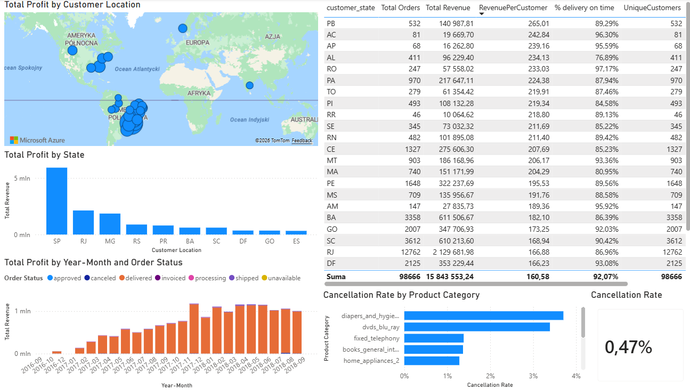
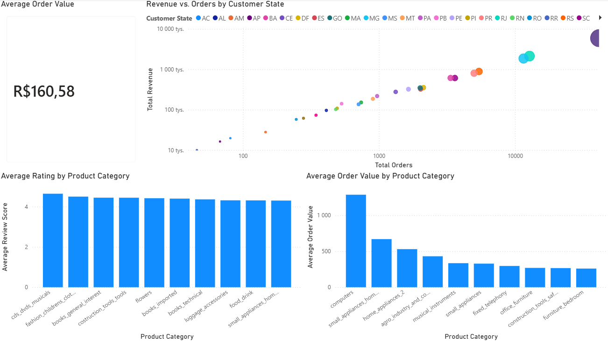
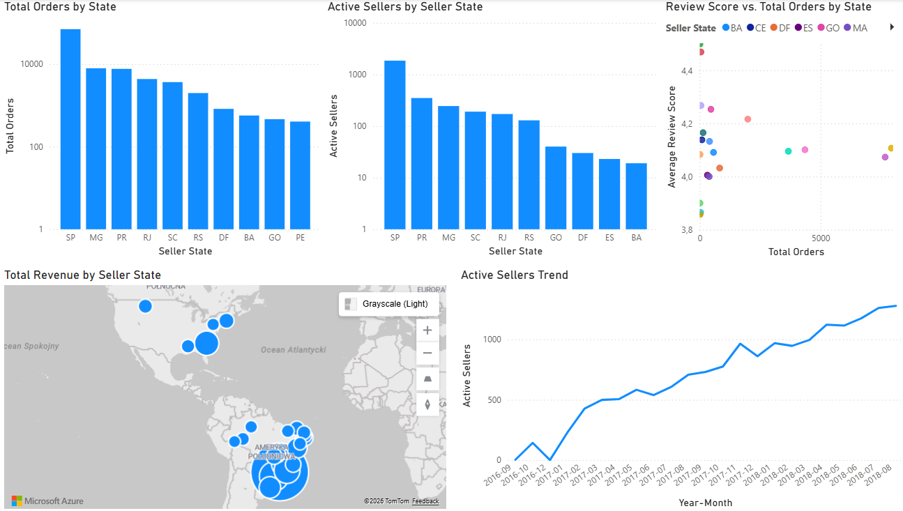

# 🛒 Olist E-Commerce Analysis - Brazilian Marketplace Case Study

A comprehensive analysis of sales data from **Olist**, the largest Brazilian marketplace. The report covers 2016–2018 and processes **98.67k orders** with a total value of **15.84M BRL**.

---

## 📈 Business Insights & Recommendations

* **The São Paulo (SP) Paradox:** This state generates the highest total profit but has the **lowest Revenue per Customer (R$166.88)** among the top regions. This is due to a massive customer base but relatively "low-value" baskets.
* **Expansion Potential in Rio De Janeiro (RJ) and Minas Gerais (MG):** These states rank 2nd and 3rd in order volume, and their Revenue per Customer is higher than in SP. 
* **Recommendation:** It is suggested to optimize marketing spend for **RJ and MG** to leverage the higher purchasing potential per customer while utilizing the existing logistics infrastructure.

---

## 🏗️ Data Architecture

The report is built on a professionally designed **Star Schema**.

**Technical Model Highlights:**
* **Surrogate Keys:** Every dimension table uses a unique numerical index (`customer_sk`, `product_sk`, etc.) to optimize performance and ensure independence from system IDs.
* **1:N Relationships:** The model ensures clean one-way filtering, preventing calculation errors in DAX.

---

## 🛠️ ETL Process & Transformations (Power Query / M)

1.  **Aggregations:** Payment and review tables were aggregated to the order level before merging, reducing model size and eliminating duplicates.
2.  **Advanced Merging:** Integrated 8 different source tables into a cohesive `fact_order_items` table.
3.  **Dynamic dim_date:** Written from scratch in **M language**, automatically adjusting the date range based on source data.
4.  **Power Query Logic:** Calculated `delivery_days` and implemented regional flags.

---

## 📊 Report Pages

### 1. Executive Overview
Summary of key KPIs. Displays a strong revenue growth trend starting mid-2017 and the dominance of the *Health & Beauty* category.

### 2. Sales Performance
Detailed analysis of geographic profitability. Includes a profit map and a table with key metrics (Revenue per Customer, % Delivery on Time) broken down by state.

### 3. Customer & Market Intelligence
Analysis of purchasing behavior. The Scatter Chart shows the correlation between order volume and revenue, easily identifying high-potential states.

### 4. Seller Performance
Monitoring seller activity. Analysis of the growth trend in active sellers and their quality ratings (Review Score) relative to sales volume.

---

## 🧪 DAX Measures
The report utilizes performance-optimized DAX measures, including:
* `RevenuePerCustomer = [Total Revenue] / [UniqueCustomers]`
* `% delivery on time` – comparing actual delivery dates with estimated dates.
* `AVG Delivery Days` – analyzing logistical efficiency.

---

## 🚀 How to Run
1. Download the `.pbix` file.
2. Data source: [Kaggle Olist Dataset](https://www.kaggle.com/datasets/olistbr/brazilian-ecommerce/data).
3. Data is embedded in the model (Import Mode).

**Author:** Rafał Baryłka
